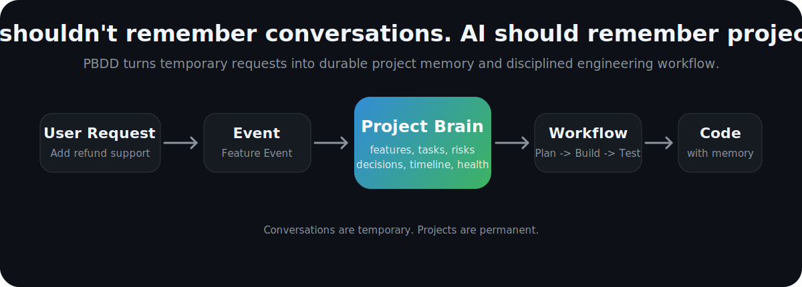

# PBDD

[中文](README.md) | English

## Project Brain Driven Development

```text
AI shouldn't remember conversations.
AI should remember projects.
```

Turn any AI Agent into a persistent software engineer by giving it a Project Brain.

<p align="center">
  
</p>

## Why PBDD?

Today, AI software development usually looks like this:

```text
You
  -> "Implement Login"
  -> AI writes code
```

Then tomorrow:

```text
New Chat
  -> "Continue"
  -> AI: "Can you explain your project?"
```

Every conversation starts from zero.

Your project has memory.

Your AI doesn't.

PBDD changes that. It moves durable memory out of chat history and into the project itself.

## The Shift

Traditional AI coding:

```text
Chat -> Context -> Code
```

PBDD:

```text
Event -> Project Brain -> Workflow -> Engineering -> Code
```

Conversations are temporary.

Projects are permanent.

## How It Works

PBDD turns every user request into an engineering event.

```text
User: Add refund support.

Agent:
  [1] Detect Feature Event
  [2] Update Project Brain
  [3] Analyze Impact
  [4] Update Specification
  [5] Create Tasks
  [6] Implement
  [7] Test
  [8] Update Brain
```

The result is not just code. The result is a project that knows what changed, why it changed, what remains risky, and what should happen next.

## Architecture

```text
                 User
                  |
                  v
            Project Agent
                  |
                  v
          PBDD Skill Runtime
                  |
                  v
             Project Brain
                  |
  ---------------------------------
  Workflow   Knowledge   State
  Spec       Tasks       History
  Risks      Decisions   Health
  ---------------------------------
                  |
                  v
              Source Code
```

PBDD is not the agent. PBDD is the project memory and engineering protocol that any agent can follow.

## The Brain

```text
Project Brain
  |-- Features
  |-- Tasks
  |-- Knowledge
  |-- Architecture
  |-- Risks
  |-- Timeline
  |-- Decisions
  `-- Health
```

Everything the project needs to remember lives here.

Not in a hidden chat.

Not in a vendor account.

Not in one agent's private context.

## Demo First

Give an agent a PBDD project and say:

```text
Add refund support.
```

A PBDD-aware agent should know the engineering move:

```text
[ok] Create a Feature Event
[ok] Update the Project Brain
[ok] Analyze affected specs and code
[ok] Create implementation tasks
[ok] Execute the workflow
[ok] Test the change
[ok] Record decisions, risks, and progress
```

The next agent can continue from the project, not from your memory.

## Principles

```text
Everything starts with an Event.

Project Brain is the source of truth.

Agents maintain engineering.

Humans maintain business intent.

Workflow over Prompt.

Projects over Conversations.
```

## Getting Started

```bash
git clone https://github.com/LittleBlacky/PBDD.git
cd PBDD
```

Copy the starter into a new project:

```bash
cp -r pbdd-starter ../my-project
```

Then ask your agent:

```text
Boot this PBDD project.
```

That's the experience PBDD is designed for.

## Repository

```text
PBDD/
  pbdd-spec/      # the open specification
  pbdd-skill/     # the agent runtime implementation
  pbdd-starter/   # the project template
```

A PBDD project looks like this:

```text
project/
  pbdd.yaml
  brain/
  artifacts/
  src/
  tests/
```

The README is the vision. The details live in the spec and docs.

## Ecosystem

```text
PBDD Specification
        |
        v
PBDD Runtime / Skill
        |
        v
Agent
        |
        v
Project
```

PBDD should not belong to one AI tool.

Claude, Cursor, ChatGPT, Codex, local agents, CI agents, and future IDEs should all be able to follow the same project brain.

## Roadmap

```text
[x] Project Brain
[x] Workflow model
[x] Event model
[x] Codex Skill runtime
[x] Starter project
[ ] Multi-agent workflow
[ ] Enterprise Brain
[ ] Cloud sync
[ ] IDE plugin
[ ] Visual workflow
[ ] Conformance test suite
```

## Manifesto

Software engineering is not about generating code.

It is about evolving projects.

PBDD teaches AI how to evolve software.

Projects should have memory.

Agents should have discipline.

Engineering should become autonomous.

```text
The future isn't AI writing code.
The future is AI owning software engineering.
```
