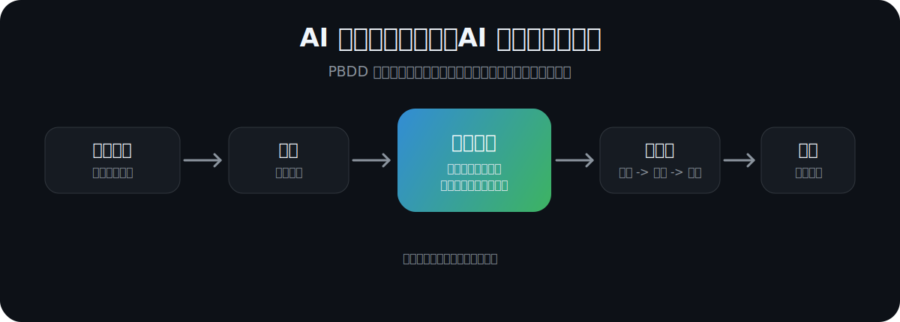

# PBDD

中文 | [English](README.en.md)

## 项目大脑驱动开发

```text
AI 不应该记住对话。
AI 应该记住项目。
```

给项目一个“项目大脑”，让任何 AI 智能体变成持续维护项目的软件工程师。

<p align="center">
  
</p>

## 为什么需要 PBDD？

今天的 AI 软件开发通常是这样：

```text
你
  -> "实现登录"
  -> AI 写代码
```

然后第二天：

```text
新对话
  -> "继续"
  -> AI: "你能先解释一下这个项目吗？"
```

每一次对话都从零开始。

你的项目有记忆。

你的 AI 没有。

PBDD 要改变这一点：把长期记忆从聊天记录里拿出来，放回项目本身。

## 范式转变

传统 AI 编程：

```text
聊天 -> 上下文 -> 代码
```

PBDD：

```text
事件 -> 项目大脑 -> 工作流 -> 工程过程 -> 代码
```

对话是临时的。

项目是长期的。

## 它如何工作

PBDD 的入口不是用户手写流程，也不是用户手动复制模板，而是 Skill。

用户在自己的项目里启用 PBDD Skill，然后让 Skill 初始化 PBDD。之后，智能体通过 Skill 创建或读取项目大脑、加载规范、执行工作流，并持续维护项目。

```text
用户：增加退款能力。

PBDD Skill：
  [1] 读取 pbdd.yaml。如果没有，就初始化 PBDD
  [2] 创建或加载项目大脑
  [3] 识别功能事件
  [4] 执行工作流
  [5] 更新规格说明和任务
  [6] 驱动智能体实现代码
  [7] 测试变更
  [8] 回写项目大脑
```

最终产物不只是代码，而是一个知道发生了什么、为什么变化、哪里还有风险、下一步该做什么的项目。

## 架构

```text
                 用户
                  |
                  v
              项目智能体
                  |
                  v
            PBDD 运行时
                  |
                  v
              项目大脑
                  |
  ---------------------------------
  工作流     知识       状态
  规格       任务       历史
  风险       决策       健康度
  ---------------------------------
                  |
                  v
                源代码
```

PBDD 不是智能体。

PBDD 是项目记忆和工程协议。任何智能体都可以遵守它。

## 项目大脑

```text
项目大脑
  |-- 功能
  |-- 任务
  |-- 知识
  |-- 架构
  |-- 风险
  |-- 时间线
  |-- 决策
  `-- 健康度
```

项目需要记住的一切，都应该在这里。

不在隐藏聊天记录里。

不在某个平台账号里。

不在某个智能体的私有上下文里。

## 先看演示

给一个智能体一个 PBDD 项目，然后说：

```text
增加退款能力。
```

一个理解 PBDD 的智能体应该知道工程动作：

```text
[完成] 创建功能事件
[完成] 更新项目大脑
[完成] 分析受影响的规格和代码
[完成] 创建实现任务
[完成] 执行工作流
[完成] 测试变更
[完成] 记录决策、风险和进度
```

下一个智能体可以从项目继续，而不是从你的记忆继续。

## 原则

```text
一切从事件开始。

项目大脑是事实源。

智能体维护工程。

人类维护业务意图。

工作流优于提示词。

项目优于对话。
```

## 快速开始

第一步，在你的智能体环境中启用 PBDD Skill。

第二步，进入任意已有项目：

```bash
cd my-project
```

第三步，对智能体说：

```text
Use the PBDD skill.
Initialize PBDD in this project.
```

Skill 会在当前项目中创建 PBDD 所需结构：

```text
pbdd.yaml
AGENTS.md
brain/
artifacts/
```

之后用户不需要手动维护 PBDD。用户只需要提需求，Skill 会告诉智能体如何读取项目大脑、执行工作流、更新产物并维护项目状态。

## 仓库结构

```text
PBDD/
  pbdd-spec/      # 开放规范
  pbdd-skill/     # 智能体运行时实现
  pbdd-starter/   # 可选项目模板
```

Skill 初始化后的项目长这样：

```text
project/
  pbdd.yaml
  AGENTS.md
  brain/
  artifacts/
  src/
  tests/
```

首页负责讲愿景。细节放在规范和文档里。

## 生态

```text
PBDD Skill
    |
    v
初始化项目大脑
    |
    v
维护工作流
    |
    v
持续演进项目
```

PBDD 不应该属于某一个 AI 工具。

同一个项目可以被不同智能体维护。关键是让这些智能体都配置对应的 PBDD Skill，这样 Claude、Cursor、ChatGPT、Codex、本地智能体、CI 智能体、未来的 IDE，都能遵守同一个项目大脑。

## 路线图

```text
[x] 项目大脑
[x] 工作流模型
[x] 事件模型
[x] Codex 技能运行时
[x] 项目模板
[ ] 多智能体工作流
[ ] 企业级项目大脑
[ ] 云端同步
[ ] IDE 插件
[ ] 可视化工作流
[ ] 一致性测试套件
```

## 宣言

软件工程不是生成代码。

软件工程是演进项目。

PBDD 教 AI 如何演进软件。

项目应该拥有记忆。

智能体应该拥有纪律。

工程应该走向自治。

```text
未来不是 AI 写代码。
未来是 AI 掌管软件工程。
```
